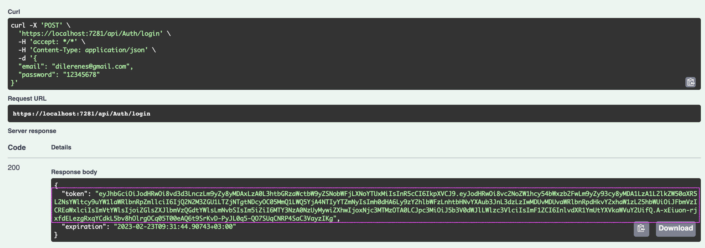
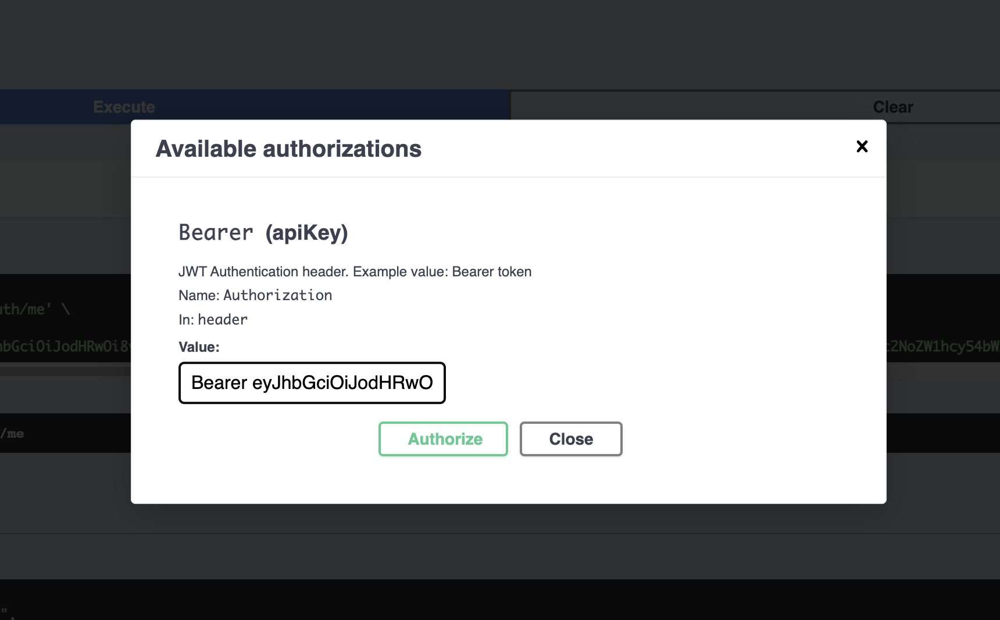

# Videons - Video API

Youtube like video sharing platform clone using .NET 6, Entity Framework, PostgreSQL.

This is just backend repository.
## Used Packages
1. Entity Framework - ORM
2. PostgreSQL - Database 
3. JWTBearer - Authentication 
4. AutoMapper - Object mapping 
5. AutoFac - Dependency Injection

## Some Features
1. Login/Signup
2. Add/Update Channel
3. Add/Update Category
4. Change 
6. Playlists 
7. Comments 
8. History
9. More...

## Running locally
After setting the postgre, at the root of your project run these commands.

```bash
dotnet build
cd Videons.DataAccess
dotnet ef migrations add [Migration Name]  --startup-project ../Videons.WebAPI --output-dir Migrations 
dotnet ef database update --startup-project ../Videons.WebAPI 
```
Then you can see the data in the database.
You can authorize the api using the token and the authentication method. Like as shown below.
### Token



### Authentication



---
Original repo:[Youtube Clone](https://github.com/mucahitnezir/youtube-clone)
